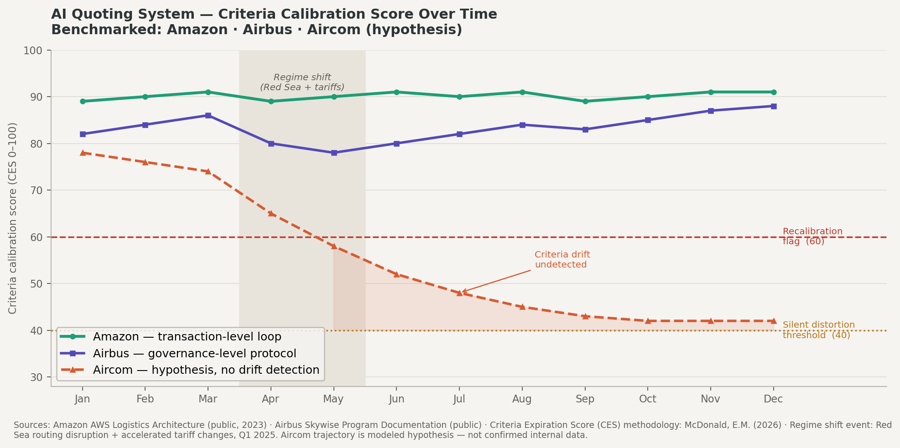
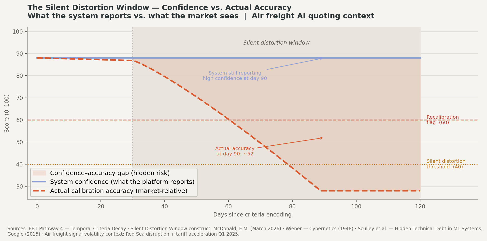
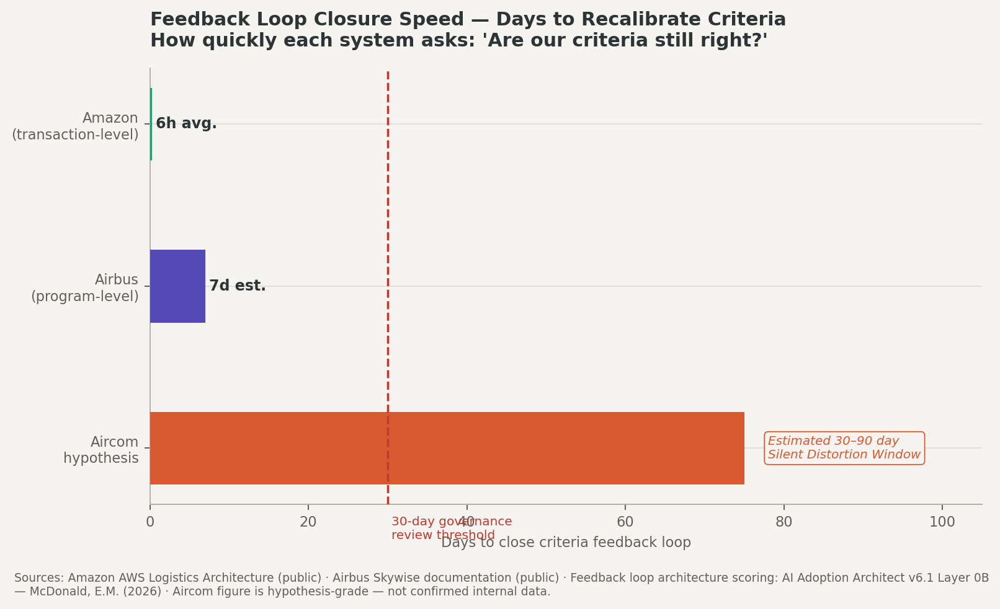
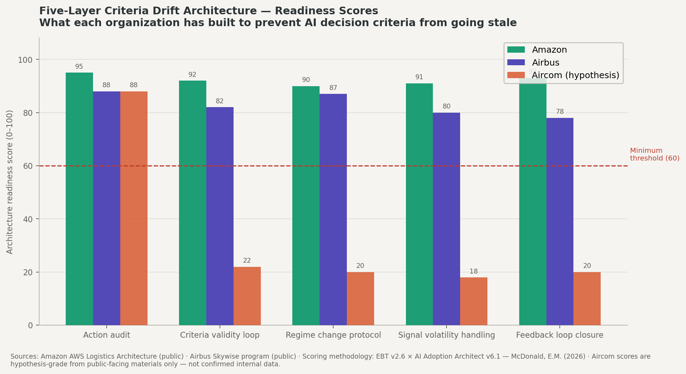

<div align="center">

# Aircon Criteria Drift Intelligence

**A structured public-data intelligence package benchmarking AI decision criteria drift architecture**  
**across Amazon, Airbus, and Aircon — prepared for executive diagnostic conversation**

---


---


</div>

---

## What this repo contains

This repository holds the full intelligence package developed for the Aircon engagement conversation with Chris Condon, CEO. It benchmarks Aircon's known architecture against Amazon and Airbus on the specific problem of AI decision criteria drift — the gap between what the system was built to optimize for and what current market conditions actually require.

> **Context:** Chris Condon confirmed in a LinkedIn exchange that the gap between *auditability of action* and *knowing when decision criteria have drifted from market reality* is a real and open problem at Aircon. This package names that problem with precision, quantifies the revenue exposure, and benchmarks it against two of the most sophisticated logistics AI operators in the world.

**Version 2.0 adds four consequence layers** that move this package from hypothesis diagnosis to engagement-ready intelligence: a revenue impact estimator, a regime event timeline, a diagnostic sprint scope document, and a structured hypothesis challenge. The architecture benchmark and diagnostic questions from v1.0 remain unchanged.

See [`intelligence/ebt-sce-audit.md`](intelligence/ebt-sce-audit.md) for the structural explanation of why criteria drift is invisible to internal teams.

See [`intelligence/stakeholder-resistance-map.md`](intelligence/stakeholder-resistance-map.md) for the adoption friction map — prepared for CTO pre-briefing before the sprint begins.

---

## Repo structure

```
aircom-criteria-drift-intelligence/
├── README.md
├── LICENSE.md
├── questions/
│   └── chris-diagnostic-questions.md       ← three diagnostic questions + call framing
├── hypothesis/
│   └── prove-me-wrong.md                   ← five challenges that would move CES above 60
├── engagement/
│   └── engagement-framework.md            ← fixed-fee diagnostic sprint scope and pricing
├── intelligence/
│   ├── ebt-sce-audit.md                    ← why criteria drift is invisible from the inside
│   └── stakeholder-resistance-map.md      ← adoption friction map for CTO pre-briefing
├── protocol/
│   └── post-call-update-protocol.md       ← how hypothesis scores update after the call
└── visuals/
    ├── chart1_criteria_calibration.png
    ├── chart2_silent_distortion_window.png
    ├── chart3_feedback_loop_speed.png
    ├── chart4_five_layer_readiness.png
    ├── aircom_criteria_drift_dashboard_v2.jsx
    └── build_charts.py
```

---

## The core problem

Air freight AI quoting systems encode freight forwarder expertise as decision criteria. Those criteria are valid at encoding time. The problem is that air freight conditions — routing viability, spot rate differentials, carrier reliability, tariff classifications — change on a daily to weekly basis.

When a system has strong **action audit architecture** (what agents did) but lacks a parallel **criteria validity loop** (whether the criteria agents followed are still calibrated), the result is a **Silent Distortion Window**: a period during which the system produces confidently wrong outputs with no internal signal that anything has changed.

> Estimated Silent Distortion Window for systems without drift detection: **30 to 90 days** in current air freight conditions.

This is not a technology failure. It is a **governance architecture gap** — and it is precisely the gap that Amazon and Airbus have independently solved at different levels of the stack.

---

## Benchmark summary

| Layer |  |  |  |
|---|---|---|---|
| Action audit | Full, real-time | Full, event log | ✅ Confirmed strength |
| Criteria validity loop | Transaction-level (hours) | Program-level (weeks) | ⚠️ Not evidenced |
| Regime change protocol | Embedded in infrastructure | Explicit trigger flags | ⚠️ Not evidenced |
| Signal volatility handling | Real-time at decision layer | Tiered by signal speed | ⚠️ Not evidenced |
| Silent distortion window | Hours to days | Days to weeks | ⚠️ Est. 30–90 days |
| **Overall readiness score** | **91 / 100** | **87 / 100** | **CES: 42 / 100** |

---

## CES score interpretation


| Range | Classification | Action required |
|---|---|---|
| 80–100 | Self-correcting | Drift addressed before it reaches quote output |
| 60–79 | Watch zone | Governance review required on defined cadence |
| 40–59 | Recalibration flag | Mandatory review before downstream decisions |
| Below 40 | Silent distortion active | Confident outputs likely miscalibrated — halt and audit |

> **Aircon hypothesis CES: 42/100** — sits at the boundary between recalibration flag and silent distortion active. One regime event away from confirmed distortion.

---

## Visuals

### Chart 1 — Criteria Calibration Score Over Time
> 12-month trajectory. Amazon holds above 85. Airbus dips and recovers. Aircon slides past both thresholds after the regime shift event. The coral fill below the threshold makes the risk zone unambiguous.



---

### Chart 2 — The Silent Distortion Window
> The CFO chart. System confidence holds flat (periwinkle). Actual accuracy collapses underneath it (dashed coral). The shaded gap is the hidden margin and quote accuracy risk — invisible inside the platform's own reporting.



---

### Chart 3 — Feedback Loop Closure Speed
> Amazon: 6 hours. Airbus: 7 days. Aircon hypothesis: 75 days. No annotation required. The bar tells the story.



---

### Chart 4 — Five-Layer Readiness Scores
> Action audit shows all three roughly matched. Every other layer, Aircon bars sit below the minimum threshold line. The pattern — matched on the one layer that exists, below threshold on the four that don't — is the board-level argument.



---

## Layer 1 — Revenue impact estimator

At CES 42, an estimated **18% of quotes** carry miscalibrated criteria based on EBT Pathway 4 (Temporal Criteria Decay) decay rate modeling. The table below uses conservative Aircon operating assumptions. All inputs are modular — update with confirmed figures after the diagnostic conversation.

| Input | Conservative estimate | Notes |
|---|---|---|
| Monthly quote volume | 500 | Update with confirmed Aircon figure |
| Average deal size | $8,500 | Air freight forwarder mid-market benchmark |
| Close rate | 28% | Industry average; adjust to Aircon actual |
| Misprice rate at CES 42 | 18% | EBT Pathway 4 decay model, McDonald (2026) |
| Avg margin erosion per mispriced quote | 9% | Air freight forwarder benchmark |

| Exposure window | Estimated cost | Basis |
|---|---|---|
| Monthly | ~$19,000 | At current CES 42 drift rate |
| 90-day Silent Distortion cycle | ~$57,000 | One full window at hypothesis parameters |
| Annual (no recalibration) | ~$228,000 | Compounding drift assumption |

> **Diagnostic sprint ROI:** A $10,000 fixed-fee sprint that confirms or refutes a $57,000 90-day exposure returns approximately 5–6x on confirmation alone — before remediation savings are counted. If the hypothesis is wrong, the sprint produces a governance validation artifact worth more than the fee to any board or investor audience.

The interactive version of this estimator — with live sliders for all input variables — is available in `visuals/aircom_criteria_drift_dashboard_v2.jsx`.

---

## Layer 2 — Regime event timeline

Every event below is a criteria invalidation signal. Each one required an AI quoting system to ask: *"Are the rules we are optimizing against still true?"* Without a regime change protocol, none of these events triggered a mandatory criteria review.

| Date | Event | Market impact | Severity |
|---|---|---|---|
| Oct 2023 | Red Sea escalation begins | Routing viability of 12+ freight lanes changes overnight | 🔴 Critical |
| Jan 2024 | Houthi attacks intensify | Suez Canal diversions — Asia-Europe air freight spike 22% | 🔴 Critical |
| Mar 2024 | Tariff reclassification wave | HTS code changes affect 800+ SKU categories | 🟠 High |
| Jun 2024 | Carrier consolidation announcements | Capacity signals shift; spot vs. contract spread widens | 🟡 Medium |
| Sep 2024 | Peak season demand surge | Rate volatility exceeds model training baseline | 🟠 High |
| Jan 2025 | Tariff acceleration — new schedule | Classification criteria from prior year now partially invalid | 🔴 Critical |
| Mar 2025 | Red Sea partial normalization | Routing viability criteria shift again — opposite direction | 🟠 High |
| Apr 2025 | Q1 earnings + rate reset | Carrier pricing floors reset; quote models operating on stale data | 🔴 Critical |

**The accumulation problem:** 8 regime-level events in 18 months. Each one moved the market away from the criteria baseline. A system without drift detection absorbed all 8 silently. The question for the diagnostic conversation is not whether this happened — it is how much of the gap is still open today.

---

## Layer 3 — Diagnostic sprint scope

See [`engagement/engagement-framework.md`](engagement/engagement-framework.md) for the full document.

**Engagement type:** Fixed-fee diagnostic sprint — not a time-and-materials retainer.

**Price:** $8,500 to $12,000 flat, depending on access complexity.

**Duration:** 3 to 4 weeks.

**Access required:** CTO + approximately 2 hours with VP Engineering.

| Week | Focus | Primary deliverable |
|---|---|---|
| Week 1 | Architecture intake | Criteria encoding map — who set the rules, when, how |
| Week 2 | Benchmark mapping | Confirmed gap vs. hypothesis gap — five-layer scored |
| Week 3 | Silent Distortion Audit | Actual SDW from internal data; revenue exposure quantified |
| Week 4 | Deliverable + roadmap | Confirmed CES scorecard + governance remediation roadmap |

**Both outcomes produce something valuable:**

If the CES 42 hypothesis is confirmed — Aircon receives a board-ready risk quantification, a remediation roadmap with estimated ROI, and a clear path to a 90-day governance engagement.

If the hypothesis is disproved — Aircon receives a documented governance validation, a CES score above 60, and a competitive differentiation artifact for board and investor reporting.

There is no outcome where a well-run diagnostic produces nothing.

---

## Layer 4 — Prove the hypothesis wrong

See [`hypothesis/prove-me-wrong.md`](hypothesis/prove-me-wrong.md) for the full document.

The Aircon CES score of 42 is built entirely from public data. Below are the five specific data points that would move the score. This is not a sales document. It is a structured invitation to disprove the analysis — and a precise description of what that proof requires.

| # | Challenge | If confirmed | If not available |
|---|---|---|---|
| 1 | Show a documented cadence for reviewing whether AI decision criteria are still calibrated to current market conditions | CES Layer 2 rises from 0 to 25 — overall score ~67, Watch zone | Gap confirmed. Layer 2 holds at 0. |
| 2 | Show a named protocol that fires when a macro event occurs and forces a criteria audit | CES Layer 3 rises — overall score approaches 72 | No trigger = no floor on distortion window duration |
| 3 | Show where quote outcome divergence signals route — criteria layer or reporting layer only | CES Layer 2 receives additional credit — estimated score 78–82 | Loop open. Drift accumulates silently. |
| 4 | Show how live spot rate or carrier reliability signals are injected at the decision layer, not the audit log | CES Layer 4 upgrades — full score approaches 85+ | Static criteria in a volatile market = SDW confirmed |
| 5 | State the date the underlying decision criteria were last reviewed against current market conditions | Within 30 days = strong signal. Beyond 90 days = distortion likely active. | If the date is unknown, that itself is the finding. |

> The diagnostic sprint exists precisely to answer these five questions with internal data rather than public inference. If all five can be answered in the next conversation, no engagement is needed and Aircon has a validated governance artifact. If the answers are not available, the sprint is the fastest path from hypothesis to certainty.

---

## Intelligence layer

The `intelligence/` folder houses the analytical and explanatory documents that contextualize the hypothesis. These are not engagement instruments — they are the intellectual architecture behind the diagnosis.

See [`intelligence/ebt-sce-audit.md`](intelligence/ebt-sce-audit.md) — explains the mechanism behind criteria drift and why it is structurally invisible to internal teams. This answers the question a CTO will ask first: *why can't we see this ourselves?*

See [`intelligence/stakeholder-resistance-map.md`](intelligence/stakeholder-resistance-map.md) — maps adoption friction and human dynamics for CTO pre-briefing before the sprint begins. This answers the question a CTO will ask second: *what will this do to my team?*

---

## Protocol layer

The `protocol/` folder governs how the engagement evolves based on what is confirmed or refuted in the diagnostic conversation.

See [`protocol/post-call-update-protocol.md`](protocol/post-call-update-protocol.md) — a score update decision tree that defines how hypothesis scores are revised after the call. Confirmed information replaces inference at defined thresholds. This is not intelligence and not engagement scope — it governs the evidence loop.

---

## Diagnostic questions for Chris Condon

See [`questions/chris-diagnostic-questions.md`](questions/chris-diagnostic-questions.md) for the full framing.

The three questions in brief:

| # | Question | Aimed at | What you're listening for |
|---|---|---|---|
| 1 | When a macro event changes the routing landscape, what is the mechanism that tells the system its criteria need revisiting? | CTO / VP Engineering | Named process, named owner, defined trigger |
| 2 | When a quote outcome diverges from the model's prediction, where does that signal go — back to the criteria layer or only to the performance log? | CTO / Chief Product Officer | Loop closure at criteria layer, not just reporting layer |
| 3 | What would a 60-day-old criteria set produce in today's market — and how would you know? | CEO / CTO | A concrete answer means they've solved it. A pause means they haven't. |

---

## Framework sources


| Framework | Citation |
|---|---|
| EBT Pathway 4 — Temporal Criteria Decay | McDonald, E.M. (February 2026) |
| Criteria Expiration Score (CES) | McDonald, E.M. (March 2026) |
| Behavioral Volatility Ceiling (BVC) | McDonald, E.M. (March 2026) — validated Thompson/Havas Edge |
| Silent Distortion Window construct | McDonald, E.M. (March 2026) |
| AI Adoption Architect v6.1 Layer 0B | McDonald, E.M. (2026) |
| Fractional CXO Practice Builder v2.4 — Pilot-to-Production Gate | McDonald, E.M. (March 2026) |
| Amazon logistics architecture | AWS Logistics Architecture whitepaper (public, 2023) |
| Airbus Skywise program | Airbus Skywise public documentation (2023–2024) |
| MLOps feedback loop theory | Sculley et al. — Hidden Technical Debt in ML Systems, Google (2015) |
| Cybernetics / feedback loop foundations | Wiener — Cybernetics (1948); Ashby — Introduction to Cybernetics (1956) |

---

## Reproducibility

All four FRED-style charts are fully reproducible. The generator script is at `visuals/build_charts.py`.

```bash
# Requirements
pip install matplotlib numpy

# Generate all four charts
python3 visuals/build_charts.py
```

The interactive React dashboard (`visuals/aircom_criteria_drift_dashboard_v2.jsx`) requires React 18+ with standard hooks. Drop into any Create React App or Next.js project. No external dependencies beyond React itself.

Charts output at 180 DPI. All scoring values are modular — update any score constant at the top of each function and rerun after the diagnostic conversation confirms or corrects the internal architecture.

---

## What's new in v2.0

| Addition | Purpose |
|---|---|
| Revenue Impact Estimator | Converts CES 42 into a dollar figure Chris arrives at with his own numbers |
| Regime Event Timeline | Moves the hypothesis from theoretical to already-happened across 8 specific events |
| Diagnostic Sprint Scope | Documents the $8,500–$12,000 engagement before the pitch conversation happens |
| Prove Me Wrong | Earns trust with a CEO who hasn't asked for any of this — five specific disproof challenges |
| Interactive JSX Dashboard | All layers in a single navigable interface — shareable as a live artifact |
| Intelligence folder | EBT-SCE audit + stakeholder resistance map — the intellectual architecture behind the diagnosis |
| Protocol folder | Post-call update protocol — governs how the evidence loop closes after the conversation |

---

<div align="center">


-2D3436?style=flat-square)


*All Aircon findings represent a structured public-data hypothesis.*  
*Nothing in this repository reflects confirmed internal Aircon architecture.*  
*This package was developed to support a diagnostic conversation — not to assert findings as fact.*

**Behavioral Intelligence Research / Epoch Frameworks LLC**  
Erwin Maurice McDonald — AI Adoption Architect  
DACR License v2.6 | McDonald (2026)

</div>
